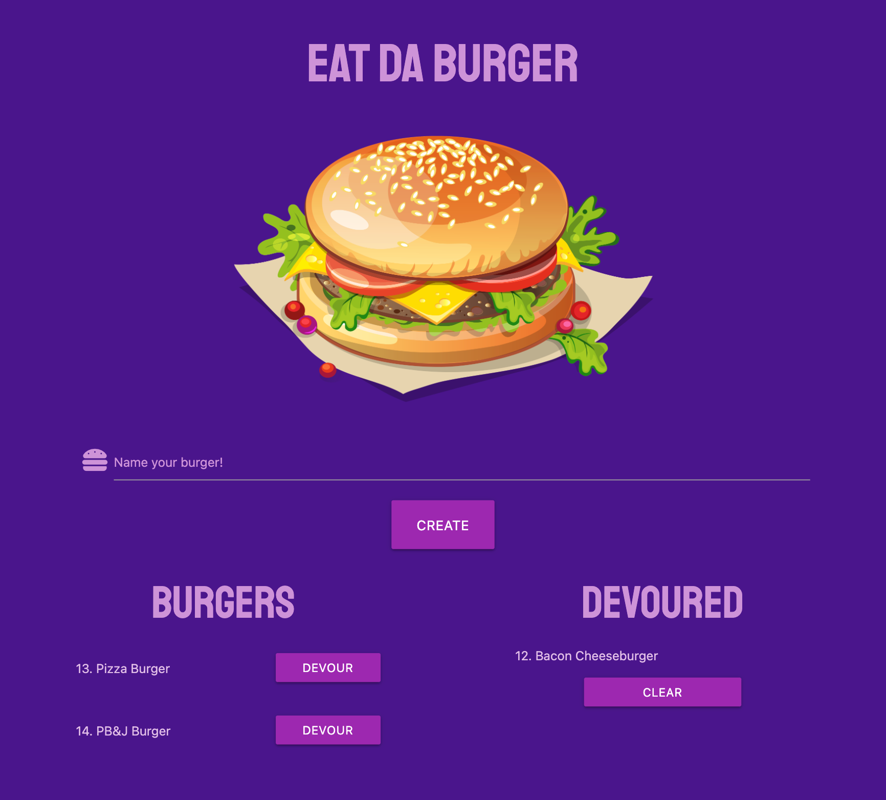

# Eat Da Burger

## Description

This web application enables users to save the names of burgers they'd like to eat. Each logged burger will be displayed in a list named 'Burgers' on the left side of the screen alongside a "Devour" button. When "Devour" is clicked, the burger is shifted over to a list on the right side of the screen named "Devoured". Additionally, a clear button is available to give the user the option of clearing out the "Devoured" list if they so choose.

## Table of Contents

- [View](#view)
- [Technology](#technology)
- [Questions](#questions)
- [License](#license)

## View

## Technology

- Node.js
- mySQL
- Express
- Handlebars
- Homemade ORM

## Questions

Please feel free to contact via email if you have any questions pertaining to this project.  
Email: jkole822@gmail.com  
[GitHub Profile](https://github.com/jkole822)

## License

[MIT](https://choosealicense.com/licenses/mit)
